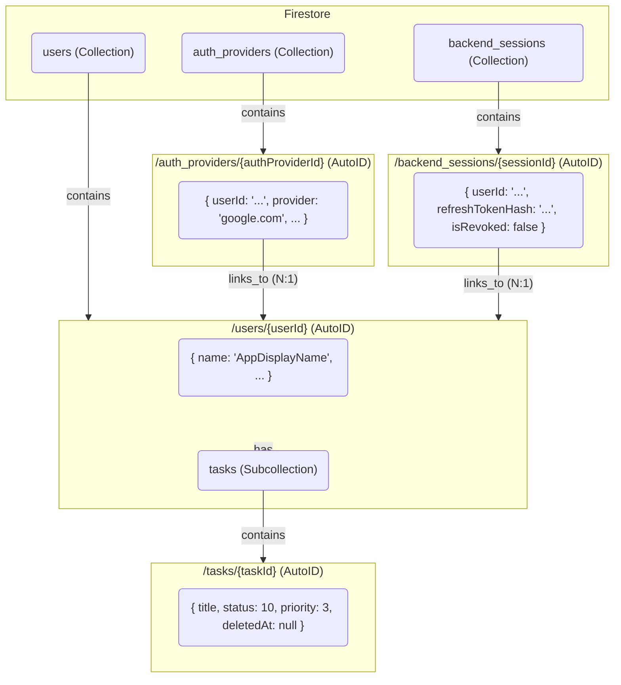

# Database Schema (データベース定義)

> **[AI Agent Instruction]**
> This document defines the Firestore database schema for this project. All data you read from or write to the database must conform to this structure. Note that this schema uses a subcollection pattern for user-owned data (`tasks`) and normalized top-level collections (`auth_providers`, `backend_sessions`) for authentication information.
>
> **[AIエージェントへの指示]**
> このドキュメントは、本プロジェクトのFirestoreデータベーススキーマを定義します。あなたがデータベースに対して行う全ての読み書きは、この構造に従う必要があります。このスキーマでは、ユーザー所有のデータ（`tasks`）にサブコレクションパターンを、認証情報（`auth_providers`, `backend_sessions`）にはRDBMSへの移行性を考慮した正規化トップレベルコレクションパターンを採用している点に注意してください。

---

## 1. `users` Collection

Stores basic profile information for each user *within this application*.
**[解説]** アプリケーションの各ユーザーの基本プロファイル情報（アプリ内での表示名など）を格納するトップレベルのコレクションです。

* **Path:** `/users/{userId}`
* **Document ID (`userId`):** A unique ID auto-generated by Firestore. This ID is the internal identifier for the user within the application.
    * **[解説]** ドキュメントIDには、Firestoreが自動生成する一意なIDを使用します。これがアプリケーション内部でのユーザー識別子となります。

| Field Name (フィールド名) | Type (データ型) | Description (説明) |
| :--- | :--- | :--- |
| `name` | `string` | User's display name *within this application*. (Populated from the first auth provider, can be updated by the user later). |
| `createdAt` | `timestamp` | Timestamp when the user first logged in. |
| `updatedAt` | `timestamp` | Timestamp when the user information was last updated. |

---

## 2. `auth_providers` Collection

Stores authentication provider information linked to a user, including **sensitive tokens**. This normalized structure ensures future compatibility with RDBMS.
**[解説]** ユーザーに紐づく認証プロバイダ情報（Google, Microsoftなど）と、**機密情報であるトークン類**を格納するトップレベルのコレクションです。将来のRDBMSへの移行を容易にするため、`users`とは1対多の正規化された関係を持ちます。

* **Path:** `/auth_providers/{authProviderId}`
* **Document ID (`authProviderId`):** A unique ID auto-generated by Firestore.
    * **[解説]** ドキュメントIDには、Firestoreが自動生成する一意なIDを使用します。

| Field Name (フィールド名) | Type (データ型) | Description (説明) |
| :--- | :--- | :--- |
| `userId` | `string` | The internal user ID (references `/users/{userId}`). |
| `provider` | `string` | The authentication provider (e.g., `"google.com"`, `"microsoft.com"`). |
| `providerAccountId` | `string` | The user's account ID *within* that provider (e.g., Google's `sub` or Microsoft's `oid`). |
| `email` | `string` | The email address associated with this specific provider. |
| `encryptedAccessToken` | `string` | The encrypted OAuth `access_token` from the provider (e.g., Google, Microsoft). **Must be encrypted by the backend** before saving. |
| `encryptedRefreshToken` | `string` | The encrypted OAuth `refresh_token` from the provider (e.g., Google, Microsoft). **Must be encrypted by the backend** before saving. |
| `expiresAt` | `timestamp` | The exact timestamp when the provider's `access_token` expires. **Stored as a UTC datetime (Python `datetime(UTC)`), which Firestore stores as a Timestamp.** |
| `createdAt` | `timestamp` | Timestamp when the auth provider record was created. |
| `updatedAt` | `timestamp` | Timestamp when the auth provider record was last updated. |

---

## 3. `backend_sessions` Collection

Stores backend-issued refresh token sessions for API authentication. Each session represents a valid refresh token that can be used to obtain new API access tokens.
**[解説]** バックエンドが発行したリフレッシュトークンのセッションを管理するトップレベルコレクションです。各セッションは、新しいAPIアクセストークンを取得するために使用できる有効なリフレッシュトークンを表します。

* **Path:** `/backend_sessions/{sessionId}`
* **Document ID (`sessionId`):** A unique ID auto-generated by Firestore.
    * **[解説]** ドキュメントIDには、Firestoreが自動生成する一意なIDを使用します。

| Field Name (フィールド名) | Type (データ型) | Description (説明) |
| :--- | :--- | :--- |
| `userId` | `string` | The internal user ID (references `/users/{userId}`). |
| `refreshTokenHash` | `string` | SHA-256 hash of the backend-issued refresh token. **The raw token is never stored; only the hash is saved for verification.** |
| `expiresAt` | `timestamp` | The exact timestamp when the refresh token expires (issued time + 30 days). **Stored as a UTC datetime (Python `datetime(UTC)`), which Firestore stores as a Timestamp.** |
| `isRevoked` | `boolean` | `true` if the session has been explicitly revoked (e.g., user logout). Default: `false`. |
| `createdAt` | `timestamp` | Timestamp when the session was created. |
| `updatedAt` | `timestamp` | Timestamp when the session was last updated. |

**[解説]**
- `refreshTokenHash`: リフレッシュトークンのSHA-256ハッシュ値。**生のトークンは保存せず、検証用にハッシュのみを保存します。** これにより、DBが漏洩してもトークンを悪用されるリスクを軽減します。
- `isRevoked`: ユーザーがログアウトした際に `true` に設定し、そのリフレッシュトークンを無効化します。

---

## 4. `tasks` Subcollection

Stores tasks that belong to a specific user. This is a subcollection of a `user` document.
**[解説]** 特定のユーザーに紐づくタスクを格納します。これは`user`ドキュメントのサブコレクションです。

* **Path:** `/users/{userId}/tasks/{taskId}`
* **Document ID (`taskId`):** A unique ID auto-generated by Firestore.
    * **[解説]** ドキュメントIDには、Firestoreが自動生成する一意なIDを使用します。

| Field Name (フィールド名) | Type (データ型) | Description (説明) |
| :--- | :--- | :--- |
| `title` | `string` | The name or title of the task. (Max 255 characters). |
| `status` | `integer` | The current status. `10`: todo, `20`: in_progress, `30`: done. |
| `priority` | `integer` | The priority. `1`: low, `2`: medium, `3`: high, `4`: urgent. |
| `dueAt` | `timestamp` \| `null` | The due date for the task in UTC ISO 8601 (with trailing `Z`). `null` if not set. |
| `description` | `string` \| `null` | A detailed description of the task. (Max 100,000 characters). |
| `userId` | `string` | The ID of the user who owns this task (same as `{userId}`). |
| `createdAt` | `timestamp` | Timestamp when the task was created. |
| `updatedAt` | `timestamp` | Timestamp when the task was last updated. |
| `deletedAt` | `timestamp` \| `null` | Timestamp when the task was soft-deleted. `null` if the task is active. |

**[解説]**
- `status`: タスクの状態を整数値で管理します。`10`=未着手(todo)、`20`=進行中(in_progress)、`30`=完了(done)。
- `priority`: タスクの優先度を整数値で管理します。`1`=低(low)、`2`=中(medium)、`3`=高(high)、`4`=緊急(urgent)。
- `deletedAt`: ソフトデリート（論理削除）のタイムスタンプ。`null`の場合はアクティブなタスク、値がある場合は削除済みとして扱います。

---

### Conceptual Diagram (概念図)

